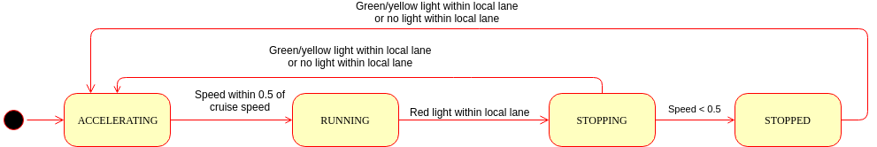

# CarND-Capstone - Imagination Ltd

## Team:

```
Ed Venator: evenator@gmail.com
  slack: @evenator
Nitin Daga: nisn_daga@yahoo.com
  slack: @nisn
Lucas Nogueira: lukscasanova@gmail.com
  slack: @lukscasanova
Alan Steremberg:	alan.steremberg@gmail.com
  slack: @alansteremberg
```

## About this Project


The capstone project is designed to pull together several concepts from the Udacity Self Driving Car Nanodegree program. We implemented these concepts as ROS nodes and integrated them into a ROS system that runs in the Udacity Styx simulator or on Udacity's self driving car, Carla. This project was super exciting to work on.

This report is split into four sections:

* Installation of a working ROS Environment
* Traffic Light Object Detection
* Waypoint Following
* Low Level Control

We tested our software on both the Udacity simulator and a ROS bag of images from Carla.  Two different Tensor Flow models were trained for the traffic light detector, and the ROS launch files contain the configuration to use the correct one for each scenario (simulation or real imagery).

## Installation and Usage

### System Requirements

- Nvidia GTX1080 or better (Nvidia Titan X should suffice)
- At least 2 core CPU
- At least 2 GB available RAM
- Ubuntu 14.04 or 16.04
- ROS Indigo or Kinetic

### Native Installation

* Follow these instructions to install ROS
  * [ROS Kinetic](http://wiki.ros.org/kinetic/Installation/Ubuntu) if you have Ubuntu 16.04.
  * [ROS Indigo](http://wiki.ros.org/indigo/Installation/Ubuntu) if you have Ubuntu 14.04.
* [Dataspeed DBW](https://bitbucket.org/DataspeedInc/dbw_mkz_ros)
  * Use this option to install the SDK on a workstation that already has ROS installed: [One Line SDK Install (binary)](https://bitbucket.org/DataspeedInc/dbw_mkz_ros/src/81e63fcc335d7b64139d7482017d6a97b405e250/ROS_SETUP.md?fileviewer=file-view-default)
* Download the [Udacity Simulator](https://github.com/udacity/CarND-Capstone/releases/tag/v1.2).

### Usage (Simulator)

1. Install python dependencies
```bash
cd CarND-Capstone
pip install -r requirements.txt
```
2. Make and run Styx
```bash
cd ros
catkin_make
source devel/setup.sh
roslaunch launch/styx.launch
```
3. Run the simulator

### Usage (Real world testing)

1. Download [training bag](https://drive.google.com/file/d/0B2_h37bMVw3iYkdJTlRSUlJIamM/view?usp=sharing) that was recorded on the Udacity self-driving car (a bag demonstrating the correct predictions in autonomous mode can be found [here](https://drive.google.com/open?id=0B2_h37bMVw3iT0ZEdlF4N01QbHc))
2. Unzip the file
```bash
unzip traffic_light_bag_files.zip
```
3. Play the bag file
```bash
rosbag play -l traffic_light_bag_files/loop_with_traffic_light.bag
```
4. Launch the project in site mode
```bash
cd CarND-Capstone/ros
roslaunch launch/site.launch
```
5. Confirm that traffic light detection works on real life images

## Traffic Light Object Detection

Before our first team meeting Nitin had started to read papers and try to implement SSD algorithms in TensorFlow.  After our first team meeting Alan and Nitin decided to team up and tackle the problem together.  The decision was made to use the TensorFlow object detection API to build and implement the models.  This cut down the implementation time to just a few minutes to create the configuration files.  Most of the work was spent trying different techniques, and writing scripts to import and export the data to the TFRecord format that tensorflow uses.  This code is in the tl_training directory.  

We had a few first failed attempts before we decided to follow the medium post by Anthony Sarkis.  Before following this, we attempted to train the network with the Udacity data set. Unfortunately a lot of the traffic lights in this data set are really far away and small. When we trained on this, the reflection of the traffic lights on the hood of Carla would be detected  - but the main light would not.  

Ed dumped a bunch of training data from the simulator, and separated it by color into three folders.  Alan hand edited 90 or so images using Mac LabelRect.  After building a tool to convert the images, and JSON from LabelRect to TFRecord. We trained a model using these 90 images, and then ran the rest of the 600 or so back through the inference. We forced the labels to the correct names - and outputted JSON that matched LabelRect.  We then used LabelRect to hand correct another batch of images. We repeated this until the model got pretty good.

When we deployed the traffic light detection onto the full stack, it didn't do terribly well.  We noticed Anthony Sarkis' post, and decided to download the Bosch data, and try his approach.  It took around 3 tried to get it working. We had problems with tensorflow complaining about NaN's, and some of the predictions didn't work that well.  After we got through that, we trained a reasonably good Bosch based model (transfer learning based on faster_rcnn_resnet101_coco_11_06_2017). We then used our Bosch trained model as the starting point for two more models, one with the simulator images, and one with images from Carla.     

We had to be careful to make sure we had a balanced data set as well. Otherwise the color detection skewed towards the color that had the largest number of samples.


In addition to some offline inference scripts, we added a new ROS variable called image_color_annotated that publishes the image_color with the bounding boxes, label, and score on them. This makes it so we can use the built in rosrun image_view to watch in realtime what is happening on the simulator or with Carla's rosbag.


We are super happy with the output from the models:


It doesn't perform as well when the lights aren't clear, and are small:


## Waypoint Following

The `waypoint_updater` find the car's current position on the `Lane` published to `/base_waypoints` and selects the next 200 waypoints. This segment is the local lane. The `waypoint_updater` sets the speed for each of the waypoints in the local lane based on the position of the next red light published to `/traffic_waypoint`. The local lane with speeds set for each waypoint is published to `/final_waypoints`.

The `waypoint_updater` is architected as a simple state machine with four states: `RUNNING`, `STOPPING`, `STOPPED`, and `ACCELERATING`. It starts in the `ACCELERATING` state. The state transitions are described in the following figure:



On each update, the `waypoint_updater` calculates the local lane of final waypoints based on the car's current position. What happens next depends on the current state. In the `ACCELERATING` and `RUNNING` states, the velocity for the entire local lane is set to a constant speed (in this case, 10 miles per hour). In the `STOPPING` state, the velocities are set using a braking profile. The velocity `v` for each waypoint in the local lane is determined according to its distance along the lane `s` from the desired stopping point according to the kinematic equation `v = (2 * s * a)^0.5`, where `a` is a maximum deceleration rate, in this case 1.0 m/s/s. Because the stop lines are not in the same place as the actual traffic lights, the value of `s` is decreased by 4.0 meters. To prevent the car from continuing forward if it overshoots the stop point, negative distance is coerced to 0. To prevent the speeds in the braking profile from exceeding the cruising speed, the minimum of the braking speed and the cruising speed is used.

## Low Level Control

The `dbw_node` in the `twist_controller` package takes in ROS `nav_msgs/Twist` messages from the Pure Pursuit Path Executor and outputs throttle, steering, and brake commands. The `dbw_node` is a ROS wrapper around a `twist_controller.Controller` object, which takes in the current twist (linear and angular velocity) and the desired twist (linear and angular velocity) and outputs throttle, brake, and sterring. The `dbw_node` then publishes these values to the Drive By Wire Interface (real or simulated).

The `twist_controller.Control` object uses a PID controller to determine the desired acceleration at each control step. The acceleration is capped by minimum and maximum acceleration limits. If the desired acceleration is greater than 0, it is compared to the current acceleration, and this error is used as the input to a PID controller that outputs the throttle value. If the acceleration is less than 0, the throttle is forced to 0. If the desired acceleration `a` is less than 0, the desired brake torque `τ` is calculated based on the vehicle mass `m` and wheel radius `r` according to the equation `τ = -a * m * r`.  If the brake torque is less than the deadband value (in this case 100 N-m), then the brake output is 0. This deadband smooths out the vehicle's speed when the desired speed is constant by coasting to slow down instead of pulsing the brakes. The resulting brake and velocity values are published to the Drive By Wire Interface to control the car.

The steering controller component of the `twist_controller.Control` object sets the steering to 0.0 (centered) if the linear velocity is less than 1.0 m/s. This is to avoid singularities in the steering calculation. When the velocity is greater than 1.0 m/s, the steering command is calculated according to the equation `steering = 0.8 * atan(wheel_base * ω / v) * steer_ratio`, where `ω` is the desired angular velocity and `v` is the desired linear velocity. That ratio, `ω/v` is the desired curvature. The resulting value `steering` is published to the Drive By Wire interface to steer the car.
